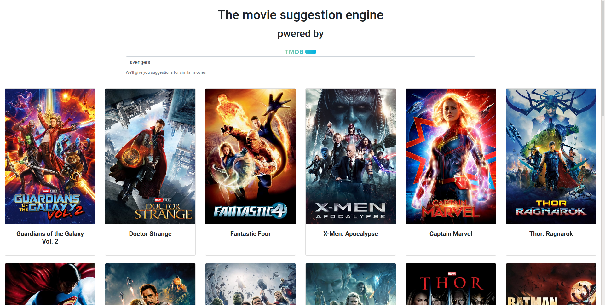

This project was bootstrapped with [Create React App](https://github.com/facebook/create-react-app).

## Movie suggestion engine

this project will give you a suggestions for movies like the one you put on the search bar.

##instructions

1. you have to get an api key from https://www.themoviedb.org/
   2.replace the needed lines in src/app.js with your API key

In the project directory, you can run:

### `npm start`

Runs the app in the development mode. 
Open [http://localhost:3000](http://localhost:3000) to view it in the browser.

